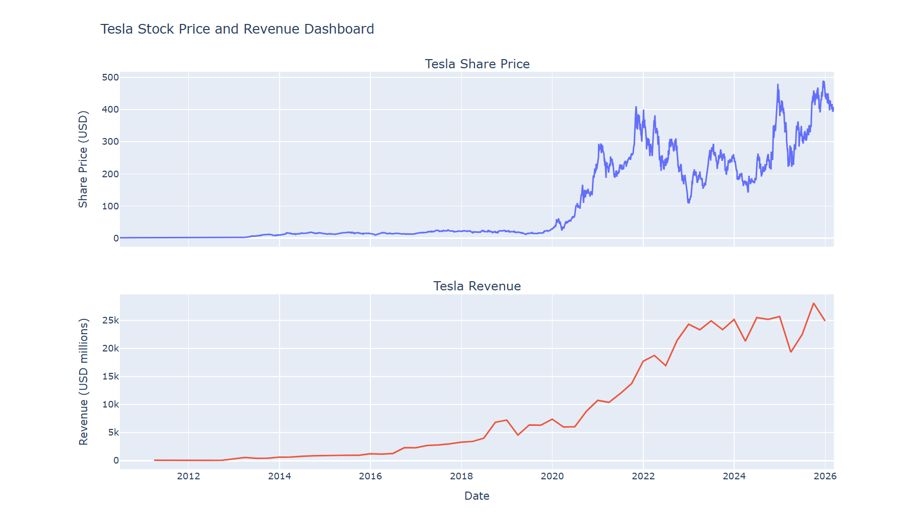
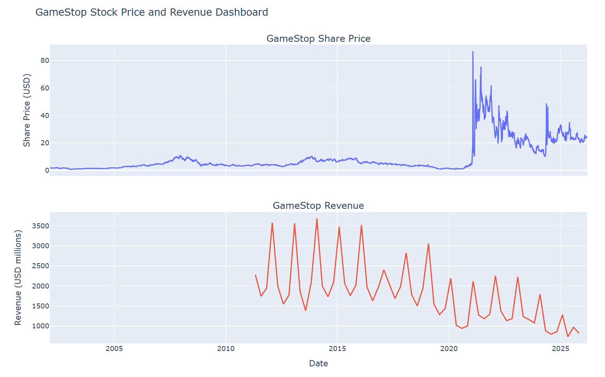

## Tesla vs GameStop Stock & Revenue Analysis

### Project Overview
This project analyzes the relationship between **company revenue growth and stock price performance** by comparing Tesla and GameStop. The analysis demonstrates how financial performance and market sentiment influence stock valuations.

### Tools Used
- Python
- Pandas
- BeautifulSoup
- yfinance API
- Plotly
- Jupyter Notebook

### Methodology
The analysis involved:
1. Extracting historical stock price data using the **yfinance API**
2. Scraping company revenue data from financial data sources
3. Cleaning and transforming datasets using **Pandas**
4. Building interactive visualizations comparing stock price trends with revenue growth

### Key Insights
- **Tesla** shows a strong relationship between revenue growth and long-term stock performance.
- **GameStop** demonstrates high stock price volatility that is not strongly tied to revenue trends.
- Market sentiment and external events can significantly influence stock prices beyond company fundamentals.

### Visualization
Below are the dashboards comparing stock prices and revenue trends.

### Project Skills Demonstrated
- Data collection and API usage  
- Web scraping  
- Data cleaning and transformation  
- Data visualization  
- Financial data analysis
